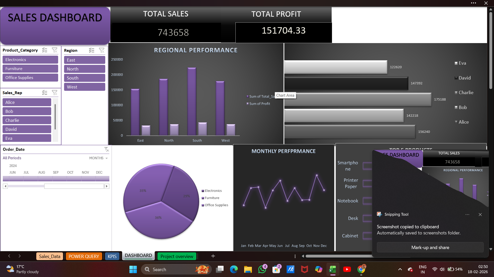

# 📊 Sales Performance Dashboard (Excel)

## 📌 Project Overview
This project is an interactive Sales Performance Dashboard built using Microsoft Excel.  
It analyzes business sales data to track performance across regions, product categories, and sales representatives.

## 🔧 Tools Used
- Microsoft Excel
- Power Query
- Pivot Tables
- KPI Metrics
- Interactive Charts & Slicers

## 📈 Key Insights
- Total Sales Performance
- Region-wise Sales Analysis
- Product Category Comparison
- Sales Representative Performance

## 🖼 Dashboard Preview
(Add screenshot below after uploading image)

## 💡 What I Learned
- Data cleaning using Power Query
- KPI calculation logic
- Dashboard structuring
- Business-focused visualization
## 🖼 Dashboard Preview

## 🖼 Dashboard Preview

